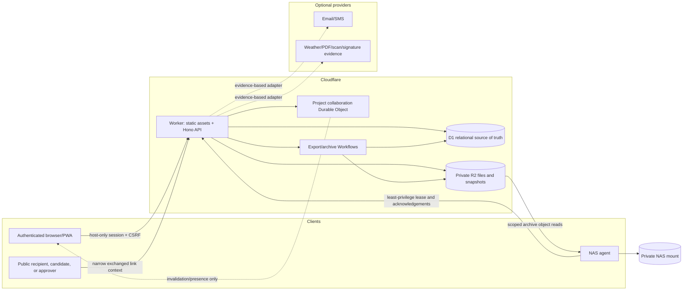

# Architecture

## Goals and boundary

The architecture supports a complete, connected pre-production graph for two current collaborators without requiring a paid third-party service. It optimizes for stable identity, explicit revisions, server-enforced policy, deterministic issued artifacts, conflict recovery, and a verifiable outbound archive.

The release ends at Ready to Shoot. Later production-day and post-production systems may attach to the same workspace, person, file, scene, schedule, and issued-artifact identities; they are not runtime modules in this release.

## System map



## Workspace structure

```text
apps/web/
  src/client/        React routes, state, module screens, offline drafts
  src/worker/        Hono routes, middleware, policies, services, bindings
  migrations/        ordered D1 migrations and integrity guards
  test/              Worker/D1, migration, security and browser support
apps/nas-agent/
  src/               lease client, downloader, safe paths, verifier, promoter
  test/              interruption and hostile-manifest fixtures
packages/domain/
  src/               schemas, IDs, numeric/time rules, sync, conflicts, readiness
packages/ui/
  src/               tokens and accessible reusable primitives
docs/
  adr/               accepted architectural decisions
```

Exact paths may be refined during implementation; changing an architectural invariant requires an ADR update.

## Runtime components

### Web application

React Router provides URL-addressable application and print routes. TanStack Query owns server cache and revalidation; TanStack Table and virtualization support dense paged operational lists. React Aria-style accessible behavior backs dialogs, menus, tabs, tables, forms, toasts, and file controls. A structured editor stores typed blocks, not opaque HTML.

The PWA service worker caches the immutable application shell only. Dexie stores explicitly supported drafts with object ID and base version. Authentication responses, project API payloads, exports, and private files are not generally cached for offline access.

### Worker

One Cloudflare Worker serves static SPA assets and a Hono API. Route groups are intentionally separate:

- `/api/v1/app/*` — cookie-authenticated workspace/project operations;
- `/api/v1/public/*` — narrow share, recipient, approver, commenter, and candidate flows;
- `/api/v1/service/*` — least-privilege NAS agent protocol;
- `/api/v1/webhooks/*` — configured provider evidence callbacks.

Middleware establishes a request ID, validates route-group authentication, content type and boundary schemas, enforces rate controls, applies origin/CSRF checks for cookie mutations, resolves tenant/object policy, and emits a typed redacted response.

Success envelopes carry `data`, `requestId`, and optional page metadata. Errors carry a stable code, safe message, request ID, optional field problems, and safe conflict comparison data. They never expose SQL, stack frames, credential material, or cross-scope existence.

### D1

D1 is authoritative for relational state, memberships, current pointers, idempotency, workflow metadata, version pins, checksums, and audit. Foreign keys are enabled. Migrations are ordered and checked in. Association tables enforce meaningful relationships instead of allowing arbitrary polymorphic blobs.

Mutable records include an integer optimistic version. A transaction/batch first asserts the expected version through a failure-producing database guard, then writes related records and increments the version. This prevents a zero-row update from allowing the rest of a batch to commit.

Immutable tables use database guards as defense in depth plus API-only creation. Restoring history creates a new revision/head transition; it does not edit old rows.

### R2

R2 remains private and has no public listing. It stores binary file versions, safe previews, immutable issue/report/export bodies, ZIP output, and archive objects. D1 records logical names, object keys, sizes, media types, integrity values, uploader/provenance, retention/scan state, and pins.

The preferred transfer path streams through an authorized Worker request to avoid exposing credentials. Larger uploads use scoped multipart state and bounded parts. Completion verifies object existence and metadata, validates file type/signature/size, computes or verifies integrity according to the transfer path, and only then marks the immutable version usable. Malware scanning is an adapter seam; absent configuration is visible.

### Workflows

Cloudflare Workflows coordinate durable, retryable export and archive preparation. Every step stores large payloads by R2/D1 reference, carries an idempotency identity, and advances an explicit monotonic job state with attempt timestamps, lease/heartbeat information, and actionable redacted error details. Workflow retries cannot mutate an already issued snapshot.

### Collaboration Durable Object

One project-scoped Durable Object coordinates ephemeral presence and ordered invalidation events. It does not own canonical document content and does not turn the editor into a CRDT. D1 commit succeeds before an invalidation event is published. Clients re-fetch through the Worker, fall back to BroadcastChannel in the same device and bounded polling across devices, and use optimistic conflict recovery for stale edits.

### NAS agent

The archive agent is a Node TypeScript CLI/service running on a maintained host with a configured NAS mount. It opens outbound HTTPS only. Its service identity can lease eligible jobs, fetch scoped object access, heartbeat, and acknowledge items/manifests; it cannot act as a user or delete cloud data.

The agent validates a literal destination root, checks safe relative paths and parent components, stages one job, checks space where the host supports it, resumes by byte range, verifies every size/integrity value, flushes durable writes when available, then promotes the complete verified staging tree atomically where the filesystem permits. It never logs credentials or signed access.

## Request and authorization flow

1. Parse the URL and attach/generate a request ID.
2. Select the authentication context from the route group; contexts are not interchangeable.
3. Apply route-appropriate rate control.
4. Validate method, content type, parameters, query, body, and relevant headers.
5. For app mutations, validate exact origin, Fetch Metadata policy, session and CSRF proof.
6. Resolve the canonical workspace, project, object type and object ownership from D1 rather than trusting client-supplied ownership.
7. Evaluate membership, role, module/action and sensitive-field grants; default deny.
8. Execute parameterized queries in the appropriate transaction/idempotency boundary.
9. Append the required audit/activity event and publish an invalidation only after success.
10. Serialize only permitted fields into a typed redacted envelope and apply response security headers.

## Authentication architecture

The production bootstrap CLI reads credentials using hidden interactive input, performs deterministic KDF qualification for the pinned Worker runtime, and sends only verifier material through a one-time protected path. Bootstrap creates missing approved identities, does not reset existing credentials, and verifies the exact active-account manifest.

Login performs equivalent work for known and unknown usernames, uses bounded backoff and edge rate controls, and returns generic errors. Session credentials are random and only their digest is stored. The production session cookie is host-only, secure, HTTP-only, strict same-site and path scoped. Sessions have idle and absolute expiry and an authentication epoch; password/privilege change rotates authority and revokes other sessions.

Mutating app requests require a per-session CSRF value returned through a same-origin session endpoint and kept in browser memory, plus origin and Fetch Metadata validation. Public-link contexts use separate narrow cookies or bearer semantics and never reuse the app cookie.

The owner-approved no-forced-first-login-rotation decision is recorded as accepted risk. It does not change any bootstrap, login, storage, rate-control, change, or revocation mechanism.

## Canonical production graph

The graph flows through stable IDs:

```text
Idea -> Project -> Writing draft -> immutable ScriptRevision
                              |-> explicit ScriptSync -> canonical Scene

Scene -> Breakdown/Elements -> People/Locations/Resources/Requirements
Scene -> Boards/Frames/Shots/Setups
Scene -> ScheduleRevision -> ShootDay -> SidesIssue/CallSheetIssue

All approved/pinned sources -> ProductionPackIssue -> ReadinessEvaluation/Issue
Project graph + issued artifacts + file versions -> ExportSnapshot -> ArchiveJob
```

Screenplay text, scene number, order, slugline, schedule order, and display names are mutable. `scene_id`, revision IDs, issue IDs, file-version IDs, and snapshot IDs are stable. Script draft save never changes production truth. Sync computes candidates and downstream impact, requires explicit resolution for uncertainty/removal, applies one transaction, and records an immutable mapping audit.

## Common object services

Comments, files, tasks, approvals, and activity attach through a validated object registry. Each registry row declares a supported object type, workspace, optional project, owning row and archive state. Application services create/remove registry entries transactionally with their domain rows. Callers cannot invent an object type/ID combination or attach across projects.

Common services own:

- typed object resolution and policy;
- comments/mentions/threading;
- file links and version pins;
- task and approval attachments;
- activity/recent-change projection;
- share-link purpose validation;
- readiness dependency registration.

## Immutable artifacts and staleness

Issuance captures canonical structured content or a pointer to a canonical R2 snapshot, exact source revision/file-version IDs, permission-filtered recipient content, an integrity manifest, author/time, and an idempotency identity. An update cannot target an issued row. A correction creates a new issue with `supersedes_id`.

Readiness and other stale-aware artifacts record dependency fingerprints. A relevant source mutation appends a change event that compares against active issue dependencies and records precise stale reasons. Staleness never mutates the frozen issue body; it changes a separate current-state projection.

## Offline and conflicts

Offline support is deliberately limited to development notes, scout notes, task/checklist edits, and visual-planning notes. Each draft stores target/object type, base server version, bounded structured content, local timestamps and retry status. Reconnect sends the original base version:

- if unchanged, the write applies and the draft is removed after server evidence;
- if stale, the server returns current/base/incoming safe data and the UI opens conflict review;
- if permission or object state changed, the draft remains exportable/copyable and the denial is honest.

The app does not claim offline support for screenplay sync, issuance, finance/legal approvals, readiness, or archive actions.

## Provider adapters and manual fallbacks

Adapters implement a narrow interface and return evidence-oriented states, never booleans that imply success. Email and SMS have a development outbox; weather can be entered/frozen manually; PDFs use deterministic print routes; signed legal documents are uploaded and tracked; maps use validated links; malware scanning exposes quarantine and `Not configured` state.

Provider webhooks authenticate, validate, deduplicate, bind to a known operation/recipient, and append evidence. Provider configuration is secret-bound and never delivered to the browser.

## Search, reporting, and performance

Potentially large lists use stable cursor pagination, intentional indexes and batch preloading. Dense tables virtualize client rendering but preserve accessible alternatives. Search is permission-filtered; a derived D1 FTS index may accelerate permitted candidates, but canonical rows are rechecked before serialization. Restore rebuilds FTS and verifies counts because virtual tables are not the canonical backup source.

Report previews query bounded, pinned data. Large generated bodies stream to R2 rather than buffering through workflow state. Print routes use deterministic ordering, explicit paper/orientation, stable fonts/assets, page-break rules and recipient field filtering.

## Reliability and recovery

- D1 migrations are forward, checked in and smoke-tested from empty state and representative prior state.
- No automated process deletes the only known good copy.
- Current pointers are repaired from immutable version history if needed; history is not erased.
- Jobs expose lease, heartbeat, attempts and actionable errors; expired leases can be safely reclaimed.
- Backup/restore includes D1 export, private R2 version manifest, secrets/binding inventory (without values), FTS rebuild, checksum verification and smoke tests.
- Deployment and rollback operate only on verified unique resources and the approved production subdomain.

## Future attachment points

Future production execution may attach take/timecard/report/continuity records to `project_id`, `shoot_day_id`, `scene_id`, `shot_id`, `person_id`, `equipment_id`, and immutable source issue IDs. Post-production may attach media/editorial/deliverable graphs to those identities and file versions. Neither future area may mutate pre-production revisions or issued Ready to Shoot history.
